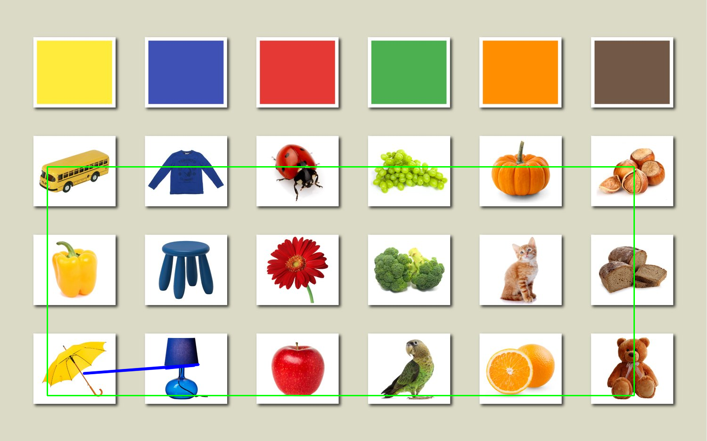

# Мобильные системы компьютерного зрения
## Лабораторная работа №2
### Выполнили: Ганыс, Рекубрацкий, Сидуков
### Преподаватель Денисов А.К.

Цель работы:
Реализовать простейшие алгоритмы сопоставления изображений.

Задание:

1) Реализовать программу согласно описанию. Можно использовать языки C++
или Python и любые библиотеки.
2) Сравнить качество работы двух вариантов реализации по точности детектирования.
3) Сделать отчёт в виде readme на GitHub, там же должен быть выложен
исходный код.

Отчёт должен содержать следующие пункты:
1) Теоретическая база
2) Описание разработанной системы (алгоритмы, принципы работы, архитектура)
3) Результаты работы и тестирования системы(скриншоты, изображения, графики, закономерности)
4) Выводы по работе
5) Использованные источники

## Теоретическая база:

1) Прямое сопоставление эталона предполагает поиск конкретного эталонного изображения на целевом изображении путем сканирования всего целевого изображения и нахождения области, которая наиболее соответствует эталонному изображению.
- Сравнение изображений: cравнивается целое эталонное изображение с подизображениями целевого изображения. Вычисляется степень сходства между эьалоном и окнами выборки разного размера из целевого изображения.
- Методы корреляции: Наиболее распространенные методы включают в себя нормализованную кросс-корреляцию, которая вычисляет степень подобия для каждого положения эталона на целевом изображении. Результатом является карта подобия, на которой пик выделяет наиболее вероятное местоположение эталона.
- Линейные фильтры: Часто используется Canny edge detection для снижения влияния незначительных шумов и выделения контуров объекта в эталоне, позволяя акцентировать внимание на важных деталях.
- Ограничения: Метод чувствителен к изменениям масштаба и поворота эталона. Для преодоления этих ограничений может потребоваться предварительная обработка или использование расширенных алгоритмов, таких как pyramidal template matching.

2) Сопоставление с использованием ключевых точек включает в себя использование алгоритмов для обнаружения и описания уникальных точек на эталонном изображении и их сопоставление с аналогичными точками на целевом изображении.
- Поиск ключевых точек эталона, которые представляют собой уникальные и легко идентифицируемые области, такие как углы, края и другие элементы с высокой контрастностью.
- Для каждой ключевой точки вычисляется дескриптор — вектор, который описывает локальные визуальные характеристики этой точки. Наиболее известные алгоритмы для извлечения дескрипторов: SIFT (Scale-Invariant Feature Transform), SURF (Speeded Up Robust Features) и ORB (Oriented FAST and Rotated BRIEF).
  В данной работе используется алгоритм — ORB.
- Сопоставление найденных дескрипторов ключевых точек на эталонном и целевом изображениях. Обычно используется метод поиска ближайших соседей (например, k-NN) для идентификации совпадений.
- Для улучшения точности используется фильтрация пар с помощью алгоритмов, таких как FLANN (Fast Library for Approximate Nearest Neighbors) и метода Раунсака (RANSAC), которые отбрасывают неточные совпадения.

## Описание разработанной системы

Система разработана с использованием библиотеки OpenCV и состоит из нескольких модулей:
- Аргументы командной строки: через командную строку принимаются пути к эталону и изображению:
  python lab2_orb.py <имя файла эталона> <имя файла изображения, содержащего эталон>
- Загрузка изображений: Изображения загружаются с помощью cv2.imread().
- Изменение размера эталона с пмощью метода resize_if_needed() для соответствия размеру входного изображения
  (если размеры эталона больше размеров изображения), чтобы избежать ошибок.
- Прямое сопоставление эталона: метод template_matching():
   - Преобразует изображения в градации серого;
   - Использует метод "matchTemplate" для поиска местоположения шаблона в изображении;
   - Отрисовывает рамку на найденной области.
- Сопоставление с использованием ключевых точек: метод feature_matching():
   - Преобразует изображения в градации серого;
   - Использует алгоритм ORB для обнаружения ключевых точек и дескрипторов;
   - Сопоставляет найденные ключевые точки с помощью BFMatcher;
   - Использует гомографию для определения положения и рисует многоугольник по контуру найденного объекта.
- Отображение результатов: Результаты выполнения алгоритмов отображаются с помощью cv2.imshow().

## Результаты работы и тестирования системы

Ниже приведены результаты работы программы:

Пример 1:

Пример 2:

Пример 3:

Пример 4:

Пример 5:

Пример 6:

Пример 7:

Пример 8:

Пример 9:

Пример 10 (сравнение двух разных изображений):

## Выводы

Прямое сравнение:
- Более устойчив к повторяющимся и похожим элементам на целевом изображении.
- Неустойчив при масштабных изменениях или поворотах эталонного изображения.

Сопоставление с использованием ключевых точек:
- Устойчив к изменениям масштаба и вращения.
- Инвариантность к освещению.
- Учет пространственного расположения ключевых точек на изображении, что помогает более точно определить положение искомого объекта.
- Чувствителен к объектам с идентичными или очень схожими особенностями с эталоном (как в примере с небоскребами), трудности с выбором нужного объекта из-за большого количества похожих ключевых точек, а мелкие различия между объектами могут не быть заметны на уровне дескрипторов.

Прямое сравнение может быть лучше в сценариях, где цели имеют чёткие границы и размеры, которые не изменяются, но может проигрывать в условиях сложного фона или требовать предварительные преобразования для масштабирования и поворота.

Сопоставление с использованием ключевых точек может быть более точным при разнообразных пейзажах и изображениях с уникальными текстурами, но может выдавать ошибки в ситуациях с близкими по виду повторяющимися объектами.
